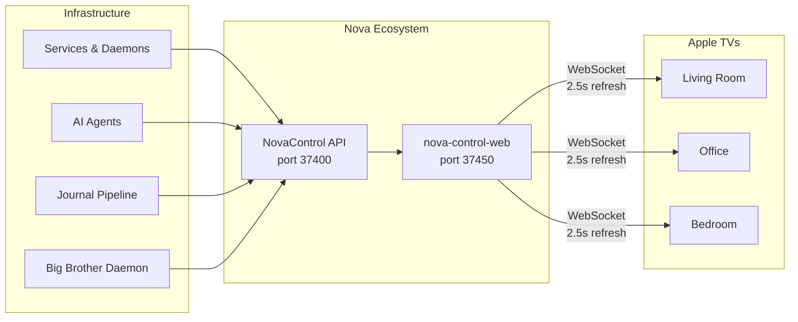
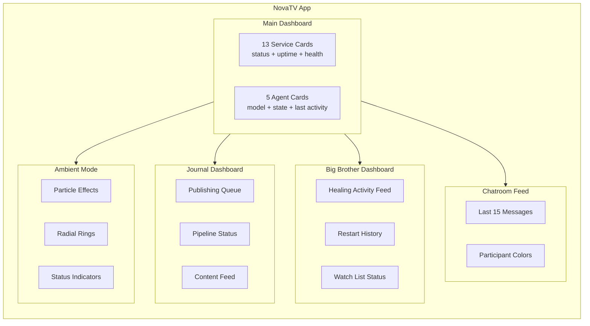

# NovaTV — Your Infrastructure, At a Glance

**Turn any Apple TV into a real-time infrastructure HUD.**

NovaTV is a tvOS dashboard application that transforms idle screens into living, breathing status displays for your entire home infrastructure. Built as part of the Nova ecosystem, it provides instant visibility into services, AI agents, publishing pipelines, and self-healing activity — all rendered in a sci-fi orbital aesthetic with particle effects, radial rings, and animated status indicators.

---

## Why NovaTV Exists

Infrastructure monitoring belongs on a screen you can glance at, not buried in a terminal tab. NovaTV puts your entire system health on the biggest display in the room — your TV. No login, no interaction required. Just look up.

---

## Key Capabilities

### Real-Time Service Monitoring
- **13 status cards** covering every monitored service
- **5 agent cards** for AI agents (research, home, code, reasoning, vision)
- WebSocket connection with **2.5-second refresh** — near-instant visibility
- Color-coded severity: green/amber/red at a glance

### Journal Dashboard
- Publishing pipeline status for all 8 daily content pieces
- Shows queued, in-progress, published, and failed states
- Direct visibility into Nova's content generation workflow

### Big Brother Dashboard
- Self-healing activity feed in real time
- Shows which services were restarted, when, and why
- 30+ watched services with automatic recovery tracking

### Chatroom Live Feed
- Last 15 messages from Nova's communication channels
- Color-coded by participant (Jordan, Nova, system)
- Passive awareness of what Nova is doing right now

### Ambient Mode
- Low-brightness idle display for always-on operation
- Particle effects and orbital animations at reduced intensity
- Designed to run 24/7 without burn-in concerns

---

## Technical Profile

| Attribute | Value |
|-----------|-------|
| Platform | tvOS 17+ |
| Language | Swift 5.9 |
| Version | 1.1.0 |
| Test Cases | 27 |
| Refresh Rate | 2.5 seconds (WebSocket) |
| Data Source | nova-control-web (port 37450) |
| API Layer | NovaControl (port 37400) |
| Deployment | 3 Apple TVs |
| Privacy | 100% local — no cloud, no telemetry |

---

## Architecture

### Data Flow

### Dashboard Layout

---

## The Nova Ecosystem

NovaTV is one component of a fully local, privacy-first AI infrastructure:

| Component | Role |
|-----------|------|
| **nova** | The brain — AI familiar, chat, reasoning, research |
| **NovaControl** | Unified API layer — single endpoint for all services |
| **NovaHealth** | The body — hardware monitoring, disk, thermal, battery |
| **nova-journal** | The voice — automated content publishing pipeline |
| **NovaTV** | The eyes — real-time visual dashboard on Apple TV |

Together, these form a self-contained system that runs entirely on local hardware with zero cloud dependencies.

---

## Design Philosophy

**Sci-fi orbital aesthetic** — NovaTV is not a utilitarian grid of numbers. It is a visual experience:

- Particle effects that pulse with system heartbeat
- Radial rings that expand and contract with load
- Animated status indicators that transition smoothly between states
- Dark theme optimized for large displays and ambient viewing
- Typography sized for readability at 10+ feet

The goal is a display you want to leave on — something that looks like a starship operations console, not a Grafana dashboard.

---

## Privacy Commitment

- **Zero cloud connectivity** — all data stays on the local network
- **No telemetry** — no analytics, no phone-home, no tracking
- **No account required** — no sign-in, no Apple ID dependency for operation
- **LAN-only WebSocket** — data never leaves your home network

---

## Deployment

NovaTV runs on standard Apple TV hardware (4K, tvOS 17+). Deploy via Xcode to any Apple TV on your network. The app auto-connects to nova-control-web on startup and begins rendering immediately.

No configuration UI needed — the app discovers its data source and starts displaying.

---

## Built By

**Jordan Koch** — Senior Manager, Site Reliability Engineering

NovaTV is part of a personal infrastructure project exploring what happens when you give an AI familiar complete visibility into your home systems and let it manage itself.

---

*Version 1.1.0 | MIT License | 100% Local | Zero Cloud*
