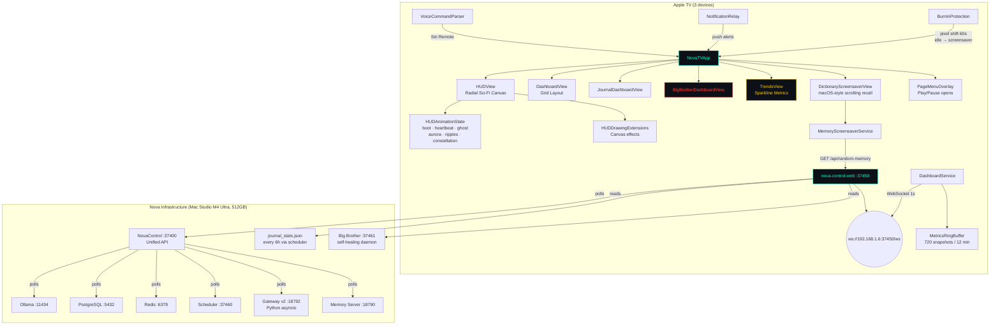
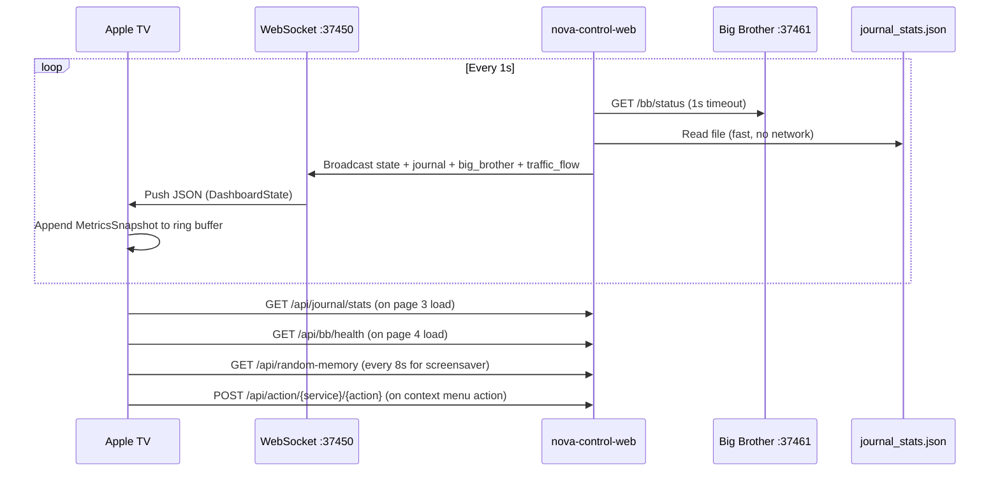

# NovaTV

tvOS dashboard for [Nova](https://github.com/kochj23/nova) AI infrastructure. Displays real-time system health, service status, journal publishing pipeline, and Big Brother oversight on Apple TV — pulling live data from nova-control-web via WebSocket push.

Written by Jordan Koch.


[](https://opensource.org/licenses/MIT)


---

## What It Does

NovaTV is a tvOS app that turns an Apple TV into a dedicated infrastructure monitoring display. It connects to `nova-control-web` over a local WebSocket and renders real-time system telemetry across 6 swipeable pages:

1. **HUD** — Radial orbital node graph showing 13 subsystems with animated particle flows, heartbeat pulse, aurora background, constellation idle mode
2. **Dashboard** — Card grid with status for system resources, gateway, scheduler, Ollama models, PostgreSQL, Redis, UniFi, conversations, task history, model usage, agents
3. **Journal** — Publishing pipeline analytics for nova.digitalnoise.net (section health, 7-day coverage heatmap, GitHub Traffic stats, deploy status)
4. **Big Brother** — Self-healing daemon oversight (service status grid, heal events, restart counts)
5. **Trends** — Sparkline charts (CPU, memory, scheduler success, Redis queue, active agents) from a 720-point rolling buffer
6. **Memories** — Dictionary-style scrolling screensaver displaying random memories fetched from PostgreSQL via the server's `/api/random-memory` endpoint

---

## Architecture



The TV app is a pure consumer — it receives the same JSON state as NovaControl via WebSocket push every second. No separate API polling needed.

---

## Data Sources

| Source | Protocol | Endpoint | Purpose |
|--------|----------|----------|---------|
| nova-control-web | WebSocket | `ws://192.168.1.6:37450/ws` | Primary state feed (1 push/sec) |
| nova-control-web | HTTP GET | `http://192.168.1.6:37450/api/detail/{service}` | Service drill-down on tap |
| nova-control-web | HTTP GET | `http://192.168.1.6:37450/api/journal/stats` | Full journal stats for page 3 |
| nova-control-web | HTTP GET | `http://192.168.1.6:37450/api/bb/health` | Full Big Brother data for page 4 |
| nova-control-web | HTTP GET | `http://192.168.1.6:37450/api/random-memory` | Random memory for screensaver |
| nova-control-web | HTTP POST | `http://192.168.1.6:37450/api/action/{service}/{action}` | Service restart/silence/trigger |
| nova-control-web | HTTP POST | `http://192.168.1.6:37450/api/notify/push` | Alert relay to paired iPhone |

All traffic stays on the local network (`192.168.1.x`). No external API calls.

---

## Data Flow



---

## What the WebSocket JSON Contains

The `DashboardState` struct decoded from each WebSocket push includes:

| Field | Type | Content |
|-------|------|---------|
| `system` | SystemState | CPU %, memory (total/used/available GB), swap, disks, network bytes |
| `gateway` | GatewayState | Status, ok bool, WebSocket reachable |
| `scheduler` | SchedulerState | Task count, running count, total runs, failures, uptime |
| `ollama` | OllamaState | Loaded models (name, family, params, quant, VRAM, context), model count |
| `postgresql` | PostgresState | Status, DB size GB, total rows, tables, index count |
| `redis` | RedisState | Status, DB size, ingest queue depth |
| `services` | [String: ServiceState] | Per-service status/port/latency |
| `agents` | [String: AgentState] | Per-agent status/model/tasks completed/uptime/errors |
| `taskHistory` | TaskHistoryState | All-time and last-24h task counts |
| `modelUsage` | ModelUsageState | Sessions, cost, tokens, per-provider breakdown |
| `conversations` | ConversationState | Active count, by-channel breakdown |
| `unifi` | UnifiState | Device count, client count, WAN uptime |
| `alerts` | [AlertItem] | Active alerts with category/severity/message |
| `trafficFlow` | [String: Double] | Per-node activity level (0.0-1.0) for particle animation |
| `journal` | JournalSummaryState | Post totals, traffic, section health, deploy status |
| `bigBrother` | BigBrotherSummaryState | Uptime, heal events, services down, pending restarts |

---

## Pages in Detail

### Page 1: HUD (Radial Orbital Graph)

Rendered entirely in SwiftUI `Canvas` at 30 FPS. 13 subsystem nodes orbit a central gateway with:

- Radial grid background with 72 spoke lines and concentric rings
- 6 rotating gateway rings with arc segments and tick marks
- Radar sweep (rotating fading arc)
- Dashed orbit paths (inner/outer) for node placement
- Per-node particle animation with logarithmic dampening (max 3 particles/node)
- Activity-colored node interiors (green idle, yellow medium, orange busy, red down)
- SF Symbol icons in each node center
- Left sidebar: live clock, memory count from PostgreSQL, scheduler success rate, CPU, RAM, loaded models, uptime, 7 status LEDs, agent panel

**Animation features (v2.1.0):**
- Boot sequence: nodes fly in one-by-one with eased timing
- Heartbeat pulse: gateway rings pulse at BPM tied to total traffic (40-180 BPM)
- Ghost trails: downed services drift outward with fading afterimages, snap back on recovery
- Aurora background: sinusoidal color bands shift by time of day
- Message ripples: expanding concentric arcs from Slack/Discord/Signal on traffic spikes
- Constellation mode: after 5 min idle, nodes drift into star patterns (Orion, Cassiopeia, Big Dipper, Scorpius)

### Page 2: Dashboard (Card Grid)

3-column `LazyVGrid` with `NavigationLink` drill-downs to `DetailView`. Cards:
- System Resources, Gateway, Scheduler, Ollama Models, PostgreSQL, Redis
- Task History, Model Usage, Conversations, UniFi Network, Services
- Journal summary card (section staleness strip)
- Big Brother summary card (services down, heal events)
- Agent grid (5 columns) showing all active sub-agents

Each card supports long-press context menu for service actions (restart, silence, trigger) via POST to nova-control-web.

### Page 3: Journal Dashboard

Fetches full stats from `GET /api/journal/stats` on load. Displays:
- Summary stats row (total posts, this week, words/week, 14d views, unique visitors)
- Section health grid: 7 sections with age color coding (green < 75% threshold, yellow < threshold, red > threshold)
- 7-day coverage heatmap: per-section per-day grid
- Last deploy status (GitHub Pages pass/fail)
- Views by section: horizontal bar chart

### Page 4: Big Brother Dashboard

Fetches full health from `GET /api/bb/health` on load. Displays:
- Stats row (uptime, heal events, services down, pending restarts)
- Service status grid: 5-column grid with colored indicators and restart counts
- Recent heal events: last 8 events with severity, issue, fix applied, timestamp

### Page 5: Trends (Sparkline Metrics)

Reads from `MetricsRingBuffer` (720 snapshots = 12 min at 1/sec). 2-column grid:
- CPU Usage (warn 50%, crit 80%)
- Memory Usage (warn 70%, crit 85%)
- Scheduler Success Rate (inverted: warn <95%, crit <90%)
- Redis Queue Depth (warn 20, crit 50)
- Active Agents (no thresholds)
- Buffer Status card (capacity, filled, fill %, connection status)

Each sparkline card shows min/avg/max and a Canvas-rendered line chart with threshold markers.

### Page 6: Dictionary Screensaver

Canvas-rendered scrolling display. Fetches random memories from `/api/random-memory` every 8 seconds. Each entry displays:
- Headword (first 1-3 words, serif font, 42pt)
- Definition text (truncated to 120 chars)
- Source metadata (source, category, year)
- CRT-style scan lines overlay

Also auto-activates as a screensaver overlay after 10 min idle (via BurnInProtectionManager).

---

## Navigation

Siri Remote directional pad swipes left/right between all 6 pages. Page indicator bar at bottom shows current position and page name. Press Play/Pause to open the page selection overlay.

| Page | View | Content |
|------|------|---------|
| 1 | HUDView | Radial orbital graph with animations |
| 2 | DashboardView | Card grid with drill-downs |
| 3 | JournalDashboardView | Publishing pipeline |
| 4 | BigBrotherDashboardView | Self-healing oversight |
| 5 | TrendsView | Sparkline metrics |
| 6 | DictionaryScreensaverView | Scrolling memory dictionary |

---

## Enterprise Features

| Feature | Implementation |
|---------|---------------|
| Burn-in protection | 2-4px random pixel shift every 60s via `BurnInProtectionManager` |
| Idle screensaver | Memory dictionary activates after 10 min idle, dismissed on any interaction |
| Per-device layout profiles | `LayoutProfile` stored in UserDefaults keyed by device UUID (start page, sidebar, compact mode, HUD scale, auto-rotate) |
| Notification relay | Severity-throttled push to paired iPhone via `POST /api/notify/push` (critical: 30s, warning: 5m, info: 15m) |
| Voice commands | `VoiceCommandParser` maps Siri phrases to page navigation and TTS status queries |
| Service actions | Context menu on cards: restart, silence, trigger via `POST /api/action/{service}/{action}` with confirmation dialog |
| Page menu overlay | Play/Pause opens focus-driven page selector with SF Symbol icon tiles |

---

## Build Requirements

| Requirement | Version |
|-------------|---------|
| Xcode | 16.0+ |
| Swift | 5.9 |
| tvOS deployment target | 17.0 |
| Apple TV hardware | 4K (2nd generation or later) |
| Backend | nova-control-web running at `192.168.1.6:37450` |

No external package dependencies. Pure SwiftUI + Foundation + AVFoundation + Speech frameworks.

---

## Project Structure

```
NovaTV/
├── NovaTVApp.swift              # App entry point, environment injection, RootView pager
├── Models/
│   ├── DashboardState.swift     # Codable models for WebSocket JSON (17 structs)
│   ├── HUDAnimationState.swift  # Animation state machine (boot/normal/constellation)
│   └── ConstellationPatterns.swift  # 4 star patterns (13 points each)
├── Services/
│   ├── DashboardService.swift   # WebSocket client + MetricsRingBuffer
│   ├── BurnInProtection.swift   # Pixel shift, idle detection, layout profiles
│   ├── MemoryScreensaverService.swift  # Fetches random memories from API
│   ├── NotificationRelay.swift  # Push alerts to iPhone via server relay
│   └── VoiceCommandParser.swift # Siri Remote phrase → action mapping + TTS
├── Views/
│   ├── HUDView.swift            # Radial Canvas visualization (622 lines)
│   ├── HUDDrawingExtensions.swift  # Aurora, heartbeat, ghost, ripple drawing
│   ├── DashboardView.swift      # Card grid with NavigationLinks
│   ├── StatusCards.swift        # CardContainer, CardStatus enum, all card views
│   ├── DetailView.swift         # Service drill-down view
│   ├── JournalAndBBViews.swift  # Journal + Big Brother full dashboards
│   ├── TrendsView.swift         # Sparkline charts + SparklineView Canvas
│   ├── DictionaryScreensaverView.swift  # Scrolling memory dictionary
│   ├── MemoryScreensaverView.swift      # Floating word animation overlay
│   ├── PageMenuOverlay.swift    # Play/Pause page selector
│   └── ServiceActionSheet.swift # Context menu action modifier
└── Info.plist
```

---

## Configuration

The WebSocket host is set in `DashboardService.swift`:

```swift
private let dashboardHost = "192.168.1.6"
private let dashboardPort = 37450
```

The same host is used by `MemoryScreensaverService` and `NotificationRelay`.

---

## Building & Deploying

```bash
# Build
cd /Volumes/Data/xcode/NovaTV
xcodebuild -project NovaTV.xcodeproj -scheme NovaTV \
  -configuration Release \
  -destination "generic/platform=tvOS" \
  CODE_SIGN_STYLE=Automatic DEVELOPMENT_TEAM=QRRCB8HB3W \
  archive -archivePath ./build/NovaTV.xcarchive

# Deploy to all 3 Apple TVs
for id in 59ACE225-758B-55E9-B0B2-303632320A8C \
          BA5C0F07-1D07-5E67-82BD-F8B8B91F5ADA \
          915604CB-97FF-5F2E-9AE6-15AEB8852719; do
  xcrun devicectl device process terminate --device $id \
    --bundle-id net.digitalnoise.NovaTV 2>/dev/null || true
  xcrun devicectl device install app --device $id ./build/NovaTV.app
  xcrun devicectl device process launch --device $id \
    --bundle-id net.digitalnoise.NovaTV
done
```

**Deployed to:**
| Device | ID |
|--------|----|
| Living Room | `59ACE225-758B-55E9-B0B2-303632320A8C` |
| Master Bedroom | `BA5C0F07-1D07-5E67-82BD-F8B8B91F5ADA` |
| Office | `915604CB-97FF-5F2E-9AE6-15AEB8852719` |

---

## Testing

```bash
xcodebuild test -scheme NovaTV -sdk appletvsimulator \
  -destination 'platform=tvOS Simulator,name=Apple TV 4K (3rd generation)'
```

114 test cases across 2 test files:

| File | Category | Tests |
|------|----------|-------|
| NovaTVTests.swift | DashboardState decoding | 2 |
| | System models (Memory, Disk, Swap, Network) | 4 |
| | Gateway / Scheduler | 2 |
| | Ollama / Services | 2 |
| | Agents | 1 |
| | Task History / Model Usage / Conversations | 3 |
| | UniFi / Alerts | 2 |
| | CardStatus utilities | 3 |
| | Format utilities (uptime, numbers) | 7 |
| | Security (no secrets, local URLs, no external APIs) | 3 |
| HUDAnimationTests.swift | Boot sequence | 5 |
| | Heartbeat | 6 |
| | Ghost trails | 9 |
| | Aurora | 2 |
| | Constellation mode | 5 |
| | Ripples | 3 |
| | Node positions | 2 |
| | ConstellationPatterns | 4 |
| | MemoryScreensaverService | 8 |
| | FloatingWord | 2 |
| | Integration (state transitions) | 5 |
| | Performance (tick, positions, ghosts, patterns, ripples, queue) | 6 |
| | Security (local URLs, no secrets, no external, no PII) | 6 |
| | Retry/resilience (network failure, malformed data, idempotent start/stop) | 6 |
| | Functional (visual lifecycle, multi-ripple, screensaver flow) | 6 |
| | Frame/smoke (instantiation, large inputs, no crash) | 11 |
| **Total** | | **114** |

---

## Privacy Model

All NovaTV traffic stays on the local network. The app connects only to `192.168.1.6:37450` (nova-control-web on the Mac Studio). No data leaves the LAN. No analytics, no telemetry, no cloud APIs.

---

## Changelog

### v2.2.0 — 2026-06-01
- Page menu overlay: press Play/Pause to open page selection with SF Symbol icon tiles
- Dictionary screensaver promoted to full page 6 (also serves as idle overlay)
- 83 new tests in HUDAnimationTests.swift (unit, integration, performance, security, retry, functional, frame)

### v2.1.0 — 2026-05-20
- 7 whimsical HUD animations: constellation mode, heartbeat pulse, ghost trails, aurora background, message ripples, boot sequence, memory screensaver
- New page 6: Memory Screensaver (Dictionary-style scrolling from PostgreSQL)
- Screensaver auto-activates on 10 min idle
- Server-side fix: `/api/random-memory` endpoint corrected
- New files: HUDAnimationState, ConstellationPatterns, HUDDrawingExtensions, MemoryScreensaverView, MemoryScreensaverService

### v2.0.1 — 2026-05-20
- Fixed particle visual clutter under heavy system load
- Logarithmic dampening caps particles at 3 per node, reduces dot size and opacity

### v2.0.0 — 2026-05-17
- 9 critical fixes: live memory count from PostgreSQL, connection-only `isConnected`, timer pauses off-screen, dynamic gateway status, metrics ring buffer
- 5 enterprise features: TrendsView sparklines, burn-in protection, per-device layout profiles, notification relay, voice command parser
- Service action sheet for restart/silence/trigger via POST API

### v1.2.0 — 2026-05-13
- Gateway reference updated: OpenClaw (node.js, :18789) replaced by Nova Gateway v2 (Python asyncio, :18792)

### v1.1.0 — 2026-05-09
- JournalDashboardView with 7-section health grid, 7-day coverage heatmap, GitHub traffic stats, deploy feed
- BigBrotherDashboardView with service status grid and heal event feed
- Left/right swipe navigation between all dashboard pages

### v1.0.0 — 2026-02-26
- Initial release with 13 status cards, HUD radial view, 5 agent cards, DetailView

---

## License

MIT License — see [LICENSE](LICENSE).

Copyright 2026 Jordan Koch.
