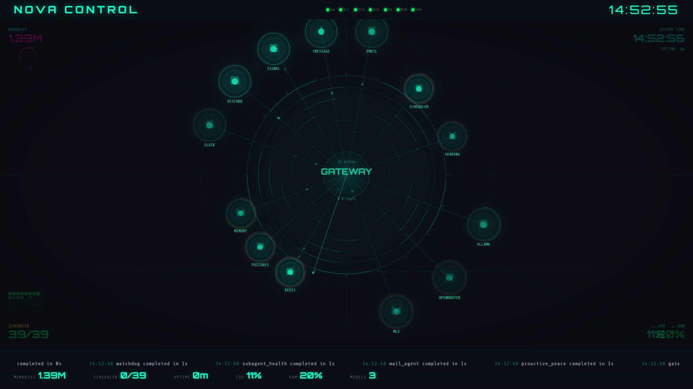
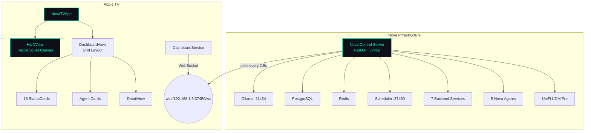

# NovaTV

tvOS dashboard for [Nova](https://github.com/kochj23/nova) AI assistant infrastructure. Displays real-time system health, service status, and performance metrics on Apple TV — pulling live data from the [Nova Control](https://github.com/kochj23/nova/tree/main/apps/nova-control-web) web dashboard API.

Written by Jordan Koch.


[](https://opensource.org/licenses/MIT)


## Screenshot



## Overview

NovaTV connects to the Nova Control dashboard via WebSocket and renders a full-screen sci-fi radial HUD visualization on Apple TV. All 13 subsystems orbit a central gateway node with real-time activity coloring, animated particle flows, and SF Symbol icons. It receives the same state updates as the web dashboard (every 2.5 seconds).

## Features

- **Real-time WebSocket connection** to Nova Control dashboard (port 37450)
- **System Resources** — CPU, RAM with progress bars, disk usage per volume
- **Gateway Health** — Status, WebSocket reachability
- **Scheduler** — Job count, running tasks, success rate, uptime
- **Ollama Models** — Loaded models with VRAM usage
- **PostgreSQL** — Database size, row count (1.3M+ memories), indexes
- **Redis** — Connection status, key count, ingest queue depth
- **Task History** — All-time succeeded/failed/timed out counts
- **Model Usage** — Session count, total tokens, OpenRouter cost
- **Conversations** — Active session count, per-channel breakdown
- **UniFi Network** — Device count, client count, WAN uptime
- **Services** — All 7 backend services with status dots and latency
- **Agent Cards** — All 5 Nova sub-agents with status, model, uptime
- **Alert Banner** — Surfaces active warnings/critical alerts
- **Auto-reconnect** — Exponential backoff on connection loss
- **Dark theme** — Designed for living room viewing

## Architecture



The TV app is a pure consumer -- it receives the same JSON state object as the web dashboard browser client via WebSocket. No separate API needed.

## Requirements

- Apple TV 4K (2nd generation or later)
- tvOS 17.0+
- Nova Control dashboard running on the local network (port 37450)
- Xcode 16.0+ for building and deploying

## Configuration

The dashboard host is configured in `DashboardService.swift`:

```swift
private let dashboardHost = "192.168.1.6"
private let dashboardPort = 37450
```

Change these if your Nova Control dashboard runs on a different IP/port.

## Building

```bash
# Generate Xcode project (requires xcodegen)
cd /Volumes/Data/xcode/NovaTV
xcodegen generate

# Open in Xcode, select your Apple TV, and Run
open NovaTV.xcodeproj
```

Deploy to your Apple TV by selecting it as the run destination in Xcode and clicking Run. Xcode handles signing automatically.

## File Structure

```
NovaTV/
├── NovaTVApp.swift              # App entry point
├── Info.plist                   # App Transport Security (allows local networking)
├── Models/
│   └── DashboardState.swift     # Codable models matching dashboard JSON schema
├── Services/
│   └── DashboardService.swift   # WebSocket connection + state management
└── Views/
    ├── DashboardView.swift      # Main layout: header, alerts, grid, agents
    └── StatusCards.swift         # 13 card views + shared components
```

## Data Sources

All data comes from the Nova Control WebSocket push (same as web dashboard):

| Card | Data Source | Key Metrics |
|------|------------|-------------|
| System | `psutil` | CPU %, RAM, disk free per volume |
| Gateway | HTTP health check | Status, WebSocket reachable |
| Scheduler | Scheduler API (37460) | 36+ jobs, success rate, uptime |
| Ollama | Ollama API (11434) | Models loaded, VRAM usage |
| PostgreSQL | `psql` subprocess | 14 GB, 1.3M+ rows |
| Redis | Redis commands | Keys, ingest queue depth |
| Tasks | SQLite (runs.sqlite) | Succeeded/failed/timed out |
| Model Usage | sessions.json | Tokens, cost, provider breakdown |
| Conversations | sessions.json | Active sessions, channel breakdown |
| UniFi | UDM Pro API | Devices, clients, WAN uptime |
| Services | HTTP probes | 7 services with latency |
| Agents | Redis meta hashes | 5 agents with status/model/uptime |

## Testing

The test suite (`NovaTVTests`) validates all Codable dashboard state models, utility functions, and security. Run tests via Xcode or the command line:

```bash
xcodebuild test -scheme NovaTV -sdk appletvsimulator -destination 'platform=tvOS Simulator,name=Apple TV 4K (3rd generation)'
```

### Test Coverage

| Category | Tests | What's Covered |
|----------|-------|----------------|
| **DashboardState** | 2 | Full JSON decoding (system, gateway, scheduler, ollama, redis, postgresql), minimal/empty state |
| **System Models** | 4 | MemoryInfo, DiskInfo, SwapInfo, NetworkInfo decoding |
| **Gateway** | 1 | Status, ok flag, WebSocket reachability |
| **Scheduler** | 1 | SchedulerInfo with success rate calculation |
| **Ollama/Services** | 2 | OllamaModel (VRAM, context length), ServiceState (latency) |
| **Agents** | 1 | AgentState with model, tasks, uptime |
| **Task/Usage/Conv** | 3 | TaskHistory all-time/24h, ModelUsage by provider, ConversationState channels |
| **UniFi/Alerts** | 2 | UnifiState, AlertItem severity |
| **CardStatus** | 3 | String-to-status mapping, colors, border color consistency |
| **Utilities** | 5 | formatUptime (nil, 0, minutes, hours, days), formatNumber (small, large, zero) |
| **Security** | 3 | No hardcoded API keys, local-network-only WebSocket, no external API endpoints |
| **Total** | **27** | |

## License

MIT License -- see [LICENSE](LICENSE) for details.

Copyright (c) 2026 Jordan Koch.
