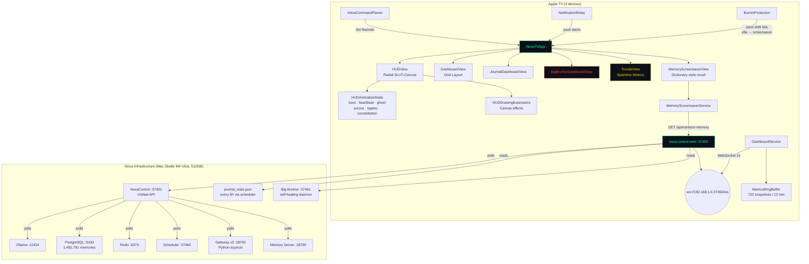
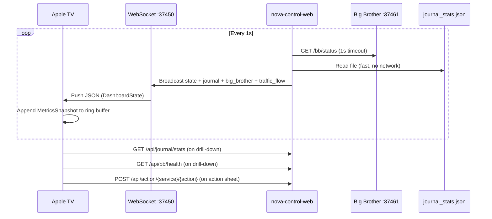
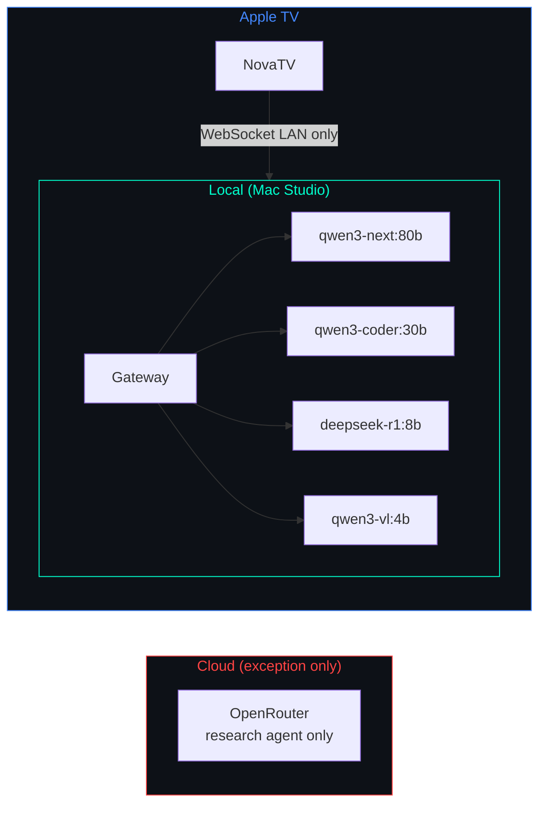

# NovaTV

tvOS dashboard for [Nova](https://github.com/kochj23/nova) AI infrastructure. Displays real-time system health, service status, journal publishing pipeline, and Big Brother oversight on Apple TV — pulling live data from nova-control-web via WebSocket push.

Written by Jordan Koch.


[](https://opensource.org/licenses/MIT)


---

## Architecture



The TV app is a pure consumer — it receives the same JSON state as NovaControl via WebSocket push every second. No separate API polling needed.

---

## Features

### Radial HUD (Page 1)
- **Orbital node graph** — 13 subsystems orbit a central gateway node with logarithmically-dampened particle flows showing real-time traffic
- **Radar sweep** — subtle rotating arc overlaid on the gateway rings
- **Left sidebar** — memory count (live from PostgreSQL), scheduler success rate, CPU, RAM, loaded models, uptime
- **Status LEDs** — gateway, ollama, memory, redis, postgres, scheduler, searxng
- **Agent panel** — all active sub-agents with model name and status

### Main Dashboard Grid (Page 2)
- **System Resources** — CPU, RAM, disk usage per volume
- **Gateway Health** — status, WebSocket reachability, channel connections
- **Scheduler** — task count, running count, success rate, uptime
- **Ollama Models** — loaded models with sizes and warmup state
- **PostgreSQL** — 1,482,791 memories across 217 domains, database size, index health
- **Redis** — connection status, ingest queue depth, memory utilization
- **Conversations** — active sessions, channel breakdown
- **Services** — all backend services with status dots and latency
- **UniFi Network** — device count, client count, WAN uptime
- **Agent Cards** — all Nova sub-agents (Sentinel, Lookout, Analyst, Librarian, Coder)
- **Alert Banner** — active warnings and critical alerts
- **Service Action Sheet** — restart/silence/trigger actions via nova-control-web POST API

### Journal Dashboard (Page 3)
- **Summary stats** — total posts, this week, words/week, 14-day views and unique visitors
- **Section health grid** — all 7 sections with last-post age, staleness color coding, delta
- **7-day coverage heatmap** — per-section per-day coverage at a glance
- **Last deploy status** — most recent GitHub Pages deploy with pass/fail
- **Views by section** — bar chart from GitHub Traffic API

### Big Brother Dashboard (Page 4)
- **Service status grid** — all monitored services (30+) with colored indicators and restart counts
- **Recent heal events** — last 8 self-healing actions with severity and fix applied
- **Summary stats** — uptime, total heal events, services down, pending restarts

### Trends Dashboard (Page 5) *(new in v2.0.0)*
- **Sparkline charts** — CPU, memory, scheduler success rate, Redis queue depth, active agents
- **12-minute rolling window** (720 data points at 1/sec)
- **Animated real-time rendering** via Canvas

### Enterprise Features *(new in v2.0.0)*
- **Burn-in protection** — 2-4px random pixel shift every 60s, idle dimming after 10 min
- **Per-device layout profiles** — stored in UserDefaults keyed by device UUID
- **Notification relay** — push alerts to iOS companion (critical/warning threshold)
- **Voice command parser** — Siri Remote play/pause triggers page navigation and service drill-down
- **Service action sheet** — restart, silence, trigger actions via POST to nova-control-web

---

### Whimsical HUD Animations *(new in v2.1.0)*
- **Boot sequence** — nodes fly in one-by-one from off-screen with eased cubic timing
- **Heartbeat pulse** — gateway rings pulse at BPM tied to total traffic load (40-180 BPM)
- **Ghost trails** — downed services drift outward with fading static afterimages, snap back on recovery
- **Aurora background** — time-of-day sinusoidal color bands (night=purple/blue, morning=pink/gold, day=cyan, evening=orange/blue)
- **Message ripples** — expanding concentric arcs from messaging nodes (Slack/Discord/Signal) on traffic spikes
- **Constellation mode** — after 5 min idle, nodes drift into star patterns (Orion, Cassiopeia, Big Dipper, Scorpius) with twinkling, snaps back on activity
- **Memory screensaver** — Dictionary-style floating words from random PostgreSQL memories, also auto-activates on 10 min idle (replaces dim overlay)

---

## Navigation

Siri Remote directional pad swipes left/right between all 6 pages. Page indicator bar at bottom shows current position.

| Page | View | Content |
|------|------|---------|
| 1 | HUDView | Radial orbital graph with animations |
| 2 | DashboardView | Card grid |
| 3 | JournalDashboardView | Publishing pipeline |
| 4 | BigBrotherDashboardView | Self-healing oversight |
| 5 | TrendsView | Sparkline metrics |
| 6 | MemoryScreensaverView | Random memories from 1.4M vectors |

---

## Data Flow



---

## Requirements

- Apple TV 4K (2nd generation or later) running tvOS 17.0+
- nova-control-web running at `192.168.1.6:37450` (Mac Studio M4 Ultra, 512GB unified memory)
- Xcode 16.0+ with tvOS 26.5 SDK to build and deploy

---

## Configuration

Set the host in `DashboardService.swift`:

```swift
private let dashboardHost = "192.168.1.6"
private let dashboardPort = 37450
```

---

## Building & Deploying

```bash
# Build
cd /Volumes/Data/xcode/NovaTV
xcodebuild -project NovaTV.xcodeproj -scheme NovaTV \
  -configuration Release \
  -destination "generic/platform=tvOS" \
  CODE_SIGN_STYLE=Automatic DEVELOPMENT_TEAM=QRRCB8HB3W \
  archive -archivePath ./build/NovaTV.xcarchive

# Deploy to all 3 Apple TVs
for id in 59ACE225-758B-55E9-B0B2-303632320A8C \
          BA5C0F07-1D07-5E67-82BD-F8B8B91F5ADA \
          915604CB-97FF-5F2E-9AE6-15AEB8852719; do
  xcrun devicectl device process terminate --device $id \
    --bundle-id net.digitalnoise.NovaTV 2>/dev/null || true
  xcrun devicectl device install app --device $id ./build/NovaTV.app
  xcrun devicectl device process launch --device $id \
    --bundle-id net.digitalnoise.NovaTV
done
```

**Deployed to:**
| Device | ID |
|--------|----|
| Living Room | `59ACE225-758B-55E9-B0B2-303632320A8C` |
| Master Bedroom | `BA5C0F07-1D07-5E67-82BD-F8B8B91F5ADA` |
| Office | `915604CB-97FF-5F2E-9AE6-15AEB8852719` |

---

## Privacy Model

Nova routes 100% of traffic locally by default. The only exception is the research agent, which uses OpenRouter (`qwen/qwen3-235b-a22b-2507`) for web-augmented queries. No conversation data, memory content, or system telemetry ever leaves the local network during normal operation.



---

## Testing

```bash
xcodebuild test -scheme NovaTV -sdk appletvsimulator \
  -destination 'platform=tvOS Simulator,name=Apple TV 4K (3rd generation)'
```

| Category | Tests |
|----------|-------|
| DashboardState decoding | 2 |
| System models | 4 |
| Gateway / Scheduler | 2 |
| Ollama / Services | 2 |
| Agents | 1 |
| Task / Usage / Conversations | 3 |
| UniFi / Alerts | 2 |
| CardStatus utilities | 3 |
| Format utilities | 5 |
| Security | 3 |
| **Total** | **27** |

---

## Changelog

### v2.1.0 — 2026-05-20
- 7 whimsical HUD features: constellation mode, heartbeat pulse, ghost trails, aurora background, message ripples, boot sequence, memory screensaver
- New page 6: Memory Screensaver — floating words from random PostgreSQL memories (Dictionary-style)
- Screensaver auto-activates on 10 min idle (replaces dim overlay)
- Server-side fix: `/api/random-memory` endpoint corrected to use proper column name
- New files: HUDAnimationState, ConstellationPatterns, HUDDrawingExtensions, MemoryScreensaverView, MemoryScreensaverService

### v2.0.1 — 2026-05-20
- Fixed particle visual clutter under heavy system load (bulk ingest spikes)
- Logarithmic dampening curve caps particles at 3 per node (was 8), reduces dot size and opacity
- HUD stays readable regardless of traffic_flow values

### v2.0.0 — 2026-05-17
- 9 critical fixes: live memory count from PostgreSQL, connection-only `isConnected`, timer pauses when off-screen, dynamic gateway status detection, metrics ring buffer
- 5 enterprise features: TrendsView sparklines, burn-in protection (pixel shift + idle dim), per-device layout profiles, notification relay, voice command parser
- Service action sheet for restart/silence/trigger via POST API

### v1.2.0 — 2026-05-13
- Gateway reference updated: OpenClaw (node.js, :18789) replaced by Nova Gateway v2 (Python asyncio, :18792)

### v1.1.0 — 2026-05-09
- Added `JournalDashboardView` with 7-section health grid, 7-day coverage heatmap, GitHub traffic stats, deploy feed
- Added `BigBrotherDashboardView` with full service status grid and heal event feed
- Left/right swipe navigation between all dashboard pages via Siri Remote

### v1.0.0 — 2026-02-26
- Initial release with 13 status cards, HUD radial view, 5 agent cards, DetailView

---

## License

MIT License — see [LICENSE](LICENSE).

Copyright © 2026 Jordan Koch.
