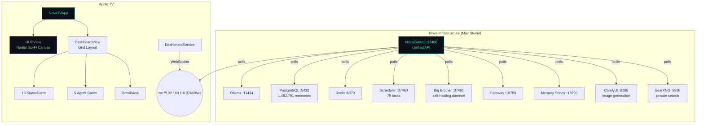
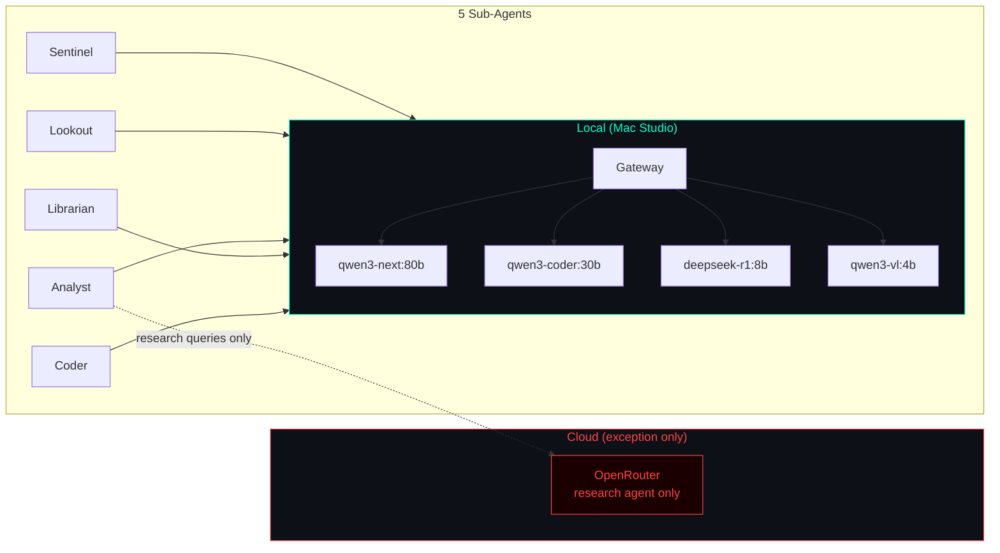

# NovaTV

tvOS dashboard for [Nova](https://github.com/kochj23/nova) AI infrastructure. Displays real-time system health, service status, and performance metrics on Apple TV — pulling live data from the NovaControl unified API on port 37400.

Written by Jordan Koch.


[](https://opensource.org/licenses/MIT)


---

## Architecture



The TV app is a pure consumer — it receives the same JSON state as NovaControl via WebSocket push every 2.5 seconds. No separate API needed.

---

## Features

- **Real-time WebSocket connection** to NovaControl (port 37400)
- **Radial HUD visualization** — all 13 subsystems orbit a central gateway node with animated particle flows
- **System Resources** — CPU, RAM, disk usage per volume
- **Gateway Health** — Status, WebSocket reachability
- **Scheduler** — 79 tasks, running count, success rate, uptime
- **Ollama Models** — Loaded models with sizes
- **PostgreSQL** — 1,482,791 memories, database size, index health
- **Redis** — Connection status, ingest queue depth
- **Memory Server** — Recall health, queue length
- **Big Brother** — Self-healing daemon status, recent heal events
- **Services** — All backend services with status dots and latency
- **Agent Cards** — All 5 Nova sub-agents (Sentinel, Lookout, Analyst, Librarian, Coder)
- **ComfyUI** — Image generation service status and queue depth
- **SearXNG** — Private search engine reachability and latency
- **Alert Banner** — Active warnings and critical alerts
- **Auto-reconnect** — Exponential backoff on connection loss
- **Dark theme** — Designed for living room display

---

## Requirements

- Apple TV 4K (2nd generation or later) running tvOS 17.0+
- NovaControl running on the local network at port 37400
- Xcode 16.0+ to build and deploy

---

## Configuration

Set the host in `DashboardService.swift`:

```swift
private let dashboardHost = "192.168.1.6"
private let dashboardPort = 37400
```

---

## Building

```bash
cd /Volumes/Data/xcode/NovaTV
xcodegen generate
open NovaTV.xcodeproj
# Select Apple TV target, Run
```

---

## Data Sources

All data comes from the NovaControl WebSocket push:

| Card | Key Metrics |
|------|------------|
| System | CPU %, RAM, disk free |
| Gateway | Status, uptime, channel connections (Slack/Discord/Signal) |
| Scheduler | 79 tasks, success rate, failures |
| Ollama | Models loaded, sizes |
| PostgreSQL | 1,482,791 rows, DB size |
| Redis | Keys, ingest queue depth |
| Memory Server | Recall health, queue |
| Big Brother | Events, services down, heal history |
| Conversations | Active sessions, channel breakdown |
| Services | 10+ services with latency |
| ComfyUI | HTTP reachability, queue depth |
| SearXNG | HTTP reachability, latency |
| Agents | 5 agents with status/model/uptime |

---

## Privacy Model

Nova routes 100% of traffic locally by default. The only exception is the research agent, which uses OpenRouter for web-augmented queries. No conversation data, memory content, or system telemetry ever leaves the local network during normal operation.



---

## Testing

```bash
xcodebuild test -scheme NovaTV -sdk appletvsimulator \
  -destination 'platform=tvOS Simulator,name=Apple TV 4K (3rd generation)'
```

| Category | Tests | Coverage |
|----------|-------|----------|
| DashboardState | 2 | Full JSON decoding, minimal state |
| System Models | 4 | MemoryInfo, DiskInfo, SwapInfo, NetworkInfo |
| Gateway / Scheduler | 2 | Status, success rate |
| Ollama / Services | 2 | OllamaModel, ServiceState with latency |
| Agents | 1 | AgentState with model/uptime |
| Task / Usage / Conv | 3 | TaskHistory, ModelUsage, ConversationState |
| UniFi / Alerts | 2 | UnifiState, AlertItem severity |
| CardStatus | 3 | String-to-status mapping and colors |
| Utilities | 5 | formatUptime, formatNumber |
| Security | 3 | No hardcoded keys, loopback only |
| **Total** | **27** | |

---

## License

MIT License — see [LICENSE](LICENSE).

Copyright © 2026 Jordan Koch.
