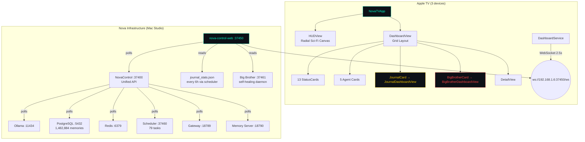
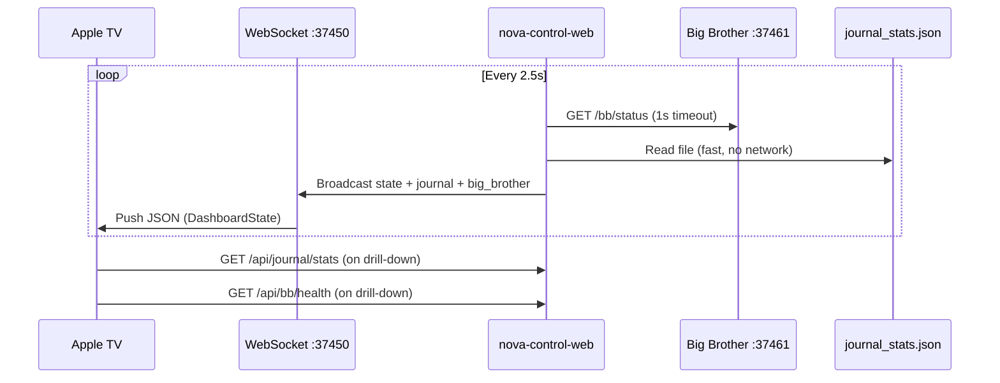
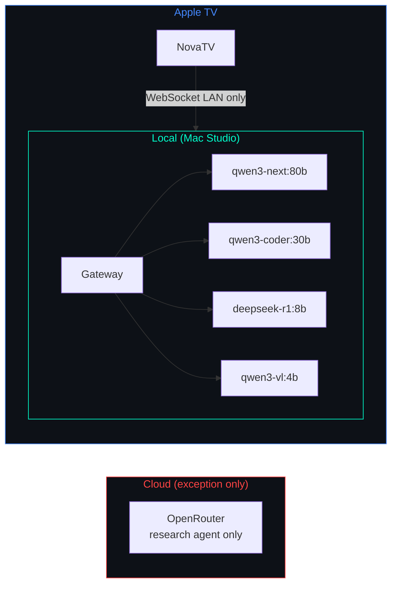

# NovaTV

tvOS dashboard for [Nova](https://github.com/kochj23/nova) AI infrastructure. Displays real-time system health, service status, journal publishing pipeline, and Big Brother oversight on Apple TV — pulling live data from the NovaControl unified API on port 37400.

Written by Jordan Koch.


[](https://opensource.org/licenses/MIT)


---

## Architecture



The TV app is a pure consumer — it receives the same JSON state as NovaControl via WebSocket push every 2.5 seconds. No separate API polling needed.

---

## Features

### Main Dashboard Grid
- **Real-time WebSocket connection** to nova-control-web (port 37450)
- **Radial HUD visualization** — all 13 subsystems orbit a central gateway node with animated particle flows
- **System Resources** — CPU, RAM, disk usage per volume
- **Gateway Health** — Status, WebSocket reachability, channel connections
- **Scheduler** — 79 tasks, running count, success rate, uptime
- **Ollama Models** — Loaded models with sizes and warmup state
- **PostgreSQL** — 1,482,884 memories, database size, index health
- **Redis** — Connection status, ingest queue depth, memory utilization
- **Conversations** — Active sessions, channel breakdown
- **Services** — All backend services with status dots and latency
- **UniFi Network** — Device count, client count, WAN uptime
- **Agent Cards** — All 5 Nova sub-agents (Sentinel, Lookout, Analyst, Librarian, Coder)
- **Alert Banner** — Active warnings and critical alerts at top of screen

### Journal Dashboard *(new in v1.1.0)*
Drill-down from `JournalCard` on the main grid:

- **Summary stats** — Total posts, this week, words/week, 14-day views and unique visitors
- **Section health grid** — All 7 sections (Dreams, Essays, Opinions, After Dark, Tech Today, Research, Digests) with last-post age, staleness color coding, this week vs last week delta
- **7-day coverage heatmap** — ✓/✗ per section per day, instantly shows any gaps
- **Last deploy status** — Most recent GitHub Pages deploy with pass/fail
- **Views by section** — Bar chart of GitHub Traffic API data broken down by section

### Big Brother Dashboard *(new in v1.1.0)*
Drill-down from `BigBrotherCard` on the main grid:

- **Service status grid** — All monitored services (30+) with colored status indicators and restart counts
- **Recent heal events** — Last 8 self-healing actions with severity, issue description, and fix applied
- **Summary stats** — Uptime, total heal events, services down, pending restarts

---

## Data Flow



---

## Dashboard Views

| View | Trigger | Data Source |
|------|---------|-------------|
| `DashboardView` | App launch | WebSocket stream |
| `HUDView` | Focus radial node | WebSocket stream |
| `JournalDashboardView` | Select JournalCard | `/api/journal/stats` + WebSocket |
| `BigBrotherDashboardView` | Select BBCard | `/api/bb/health` + WebSocket |
| `DetailView` | Select any other card | `/api/detail/{service}` |

---

## Journal Data Sources

| Stat | Source | Refresh |
|------|--------|---------|
| Post counts, coverage | Local filesystem scan | Every 6h |
| Traffic views/uniques | GitHub Traffic API | Every 6h |
| Top paths, referrers | GitHub Traffic API | Every 6h |
| Deploy history | `gh run list` | Every 6h |
| Staleness/age | Local filesystem | Every 6h |
| Scheduler task state | `scheduler_state.json` | Every 6h |

Traffic history persisted locally to survive GitHub's 14-day rolling window cliff.

---

## Requirements

- Apple TV 4K (2nd generation or later) running tvOS 17.0+
- nova-control-web running at `192.168.1.6:37450`
- Xcode 16.0+ to build and deploy

---

## Configuration

Set the host in `DashboardService.swift`:

```swift
private let dashboardHost = "192.168.1.6"
private let dashboardPort = 37450
```

---

## Building & Deploying

```bash
# Build
cd /Volumes/Data/xcode/NovaTV
xcodebuild -project NovaTV.xcodeproj -scheme NovaTV \
  -configuration Release \
  -destination "generic/platform=tvOS" \
  CODE_SIGN_STYLE=Automatic DEVELOPMENT_TEAM=QRRCB8HB3W \
  archive -archivePath ./build/NovaTV.xcarchive

# Deploy to all 3 Apple TVs
for id in 59ACE225-758B-55E9-B0B2-303632320A8C \
          BA5C0F07-1D07-5E67-82BD-F8B8B91F5ADA \
          915604CB-97FF-5F2E-9AE6-15AEB8852719; do
  xcrun devicectl device process terminate --device $id \
    --bundle-id net.digitalnoise.NovaTV 2>/dev/null || true
  xcrun devicectl device install app --device $id ./build/NovaTV.app
  xcrun devicectl device process launch --device $id \
    --bundle-id net.digitalnoise.NovaTV
done
```

**Deployed to:**
| Device | ID |
|--------|----|
| Living Room | `59ACE225-758B-55E9-B0B2-303632320A8C` |
| Master Bedroom | `BA5C0F07-1D07-5E67-82BD-F8B8B91F5ADA` |
| Office | `915604CB-97FF-5F2E-9AE6-15AEB8852719` |

---

## Privacy Model

Nova routes 100% of traffic locally by default. The only exception is the research agent, which uses OpenRouter for web-augmented queries. No conversation data, memory content, or system telemetry ever leaves the local network during normal operation.



---

## Testing

```bash
xcodebuild test -scheme NovaTV -sdk appletvsimulator \
  -destination 'platform=tvOS Simulator,name=Apple TV 4K (3rd generation)'
```

| Category | Tests |
|----------|-------|
| DashboardState decoding | 2 |
| System models | 4 |
| Gateway / Scheduler | 2 |
| Ollama / Services | 2 |
| Agents | 1 |
| Task / Usage / Conversations | 3 |
| UniFi / Alerts | 2 |
| CardStatus utilities | 3 |
| Format utilities | 5 |
| Security | 3 |
| **Total** | **27** |

---

## Changelog

### v1.1.0 — 2026-05-09
- Added `JournalDashboardView` with 7-section health grid, 7-day coverage heatmap, GitHub traffic stats, deploy feed
- Added `BigBrotherDashboardView` with full service status grid and heal event feed
- Added `JournalCard` and `BigBrotherCard` summary tiles to main dashboard grid
- Extended `DashboardState` with `journal` and `big_brother` keys from WebSocket feed
- New models: `JournalSummaryState`, `BigBrotherSummaryState` and supporting types

### v1.0.0 — 2026-02-26
- Initial release with 13 status cards, HUD radial view, 5 agent cards, DetailView

---

## License

MIT License — see [LICENSE](LICENSE).

Copyright © 2026 Jordan Koch.
